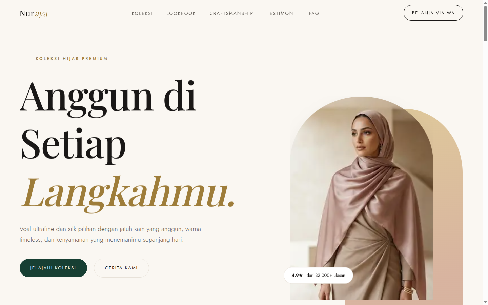
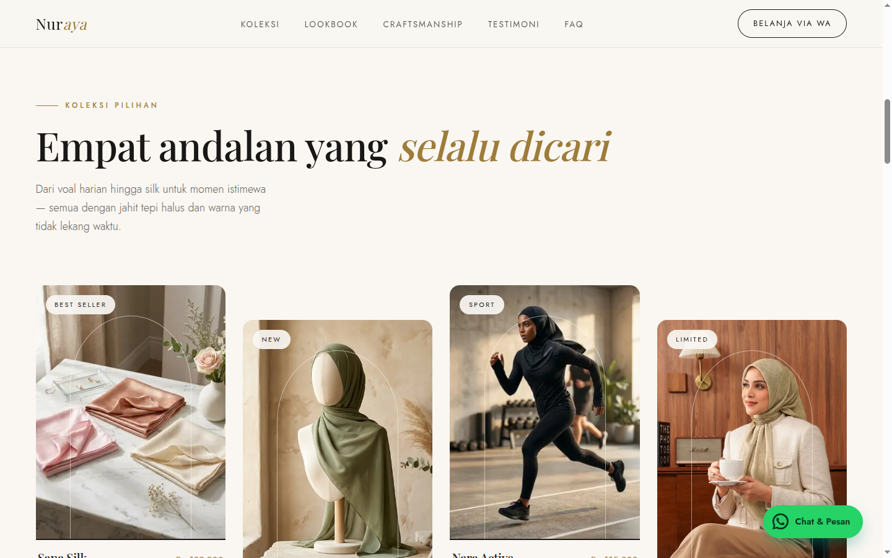
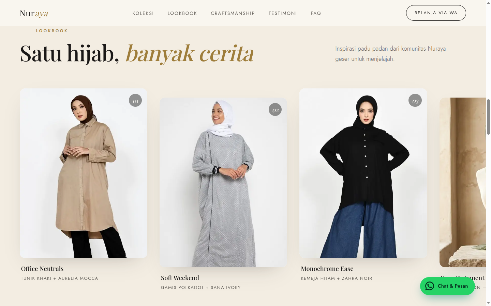
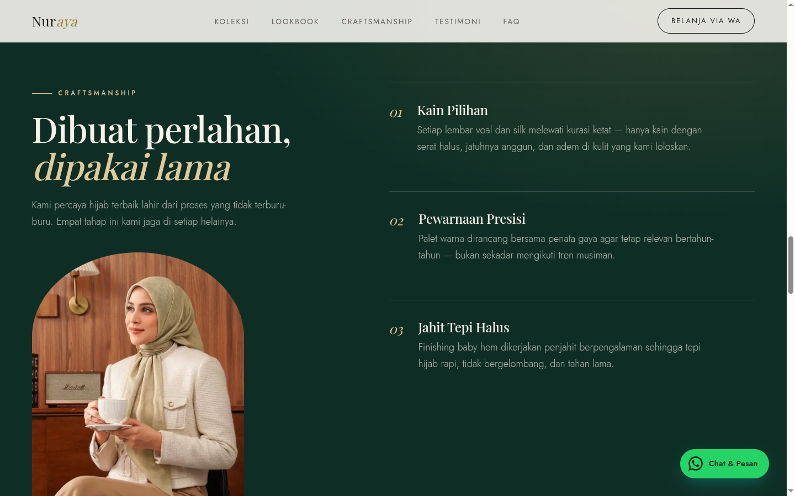
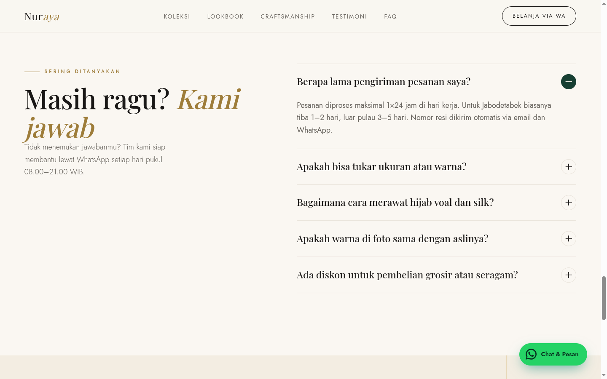
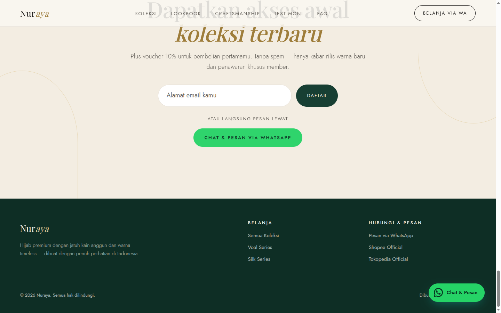
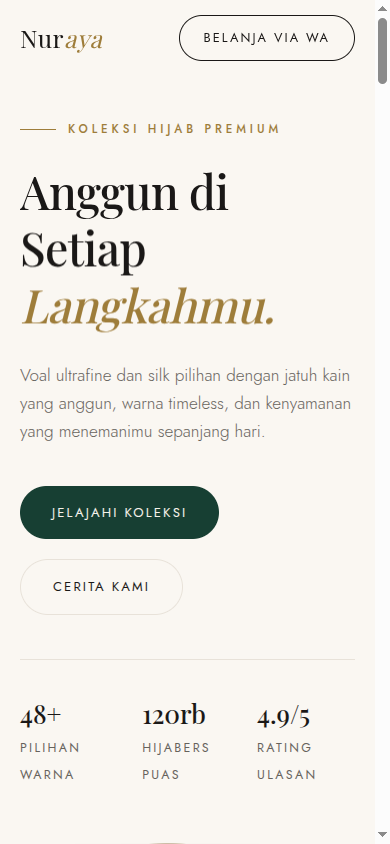

<div align="center">

# Nuraya — Landing Page Hijab Premium

Landing page **production-grade** untuk brand hijab premium, dibangun dengan **Next.js 16 (App Router)**, **React 19**, dan animasi **GSAP**. Gaya visual *light luxury / editorial* dengan foto produk asli, animasi scroll yang halus, dan seluruh jalur belanja terhubung ke **WhatsApp & marketplace**.



</div>

---

## ✨ Fitur Utama

- **9 section bertingkat** — Hero, Marquee, Koleksi, Lookbook, Craftsmanship, Testimoni, FAQ, CTA, Footer
- **Animasi GSAP production-grade**
  - Hero: *masked line-reveal* headline + clip-path reveal foto + parallax scroll
  - Lookbook: **pinned horizontal scroll** (section terkunci, kartu bergeser mengikuti scroll)
  - Craft: parallax halus foto di dalam *arch mask*
  - Scroll-reveal stagger di seluruh section
- **Belanja via WhatsApp & Marketplace** — setiap tombol produk membuka WhatsApp dengan pesan **pre-filled** (nama, kain, harga), plus link Shopee & Tokopedia + floating button
- **Foto produk asli** dioptimasi otomatis via `next/image`
- **Aksesibilitas** — HTML semantik, ARIA pada FAQ accordion, fokus keyboard
- **Menghormati `prefers-reduced-motion`** — animasi mati total, konten tetap tampil
- **Progressive enhancement** — tanpa JavaScript, halaman tetap tampil utuh (anti-FOUC)
- **SEO** — Metadata API, Open Graph, Twitter Card, JSON-LD (`Organization` + `ItemList`)
- **100% static** — di-prerender saat build, LCP cepat, zero console error

---

## 🖼️ Tampilan

| Koleksi (foto asli + hover) | Lookbook (horizontal scroll) |
|---|---|
|  |  |

| Craftsmanship | FAQ Accordion |
|---|---|
|  |  |

| CTA + Footer (WhatsApp & Marketplace) | Mobile |
|---|---|
|  |  |

---

## 🛠️ Tech Stack

| Kategori | Teknologi |
|---|---|
| Framework | Next.js 16.2 (App Router, Turbopack) |
| UI | React 19 |
| Bahasa | TypeScript 5 (strict) |
| Animasi | GSAP 3 + ScrollTrigger + `@gsap/react` (`useGSAP`) |
| Styling | CSS Modules-free — design tokens via CSS Custom Properties |
| Font | `next/font` — Playfair Display (display) + Jost (body) |
| Lint | ESLint 9 (`eslint-config-next`) |

---

## 🚀 Menjalankan Proyek

```bash
# 1. Install dependency
npm install

# 2. (Opsional) Konfigurasi nomor & marketplace — lihat bagian Konfigurasi
cp .env.example .env.local

# 3. Development
npm run dev          # http://localhost:3000

# 4. Production build
npm run build
npm run start        # http://localhost:3000

# 5. Lint
npm run lint
```

---

## ⚙️ Konfigurasi WhatsApp & Marketplace

Semua tujuan belanja diatur di satu tempat: [`src/lib/shop.ts`](src/lib/shop.ts). Buat file `.env.local` untuk menimpa nilai default:

```env
# Nomor WhatsApp format internasional tanpa "+" atau "0" di depan
# Contoh: +62 812-3456-7890  ->  6281234567890
NEXT_PUBLIC_WA_NUMBER=6281234567890

# URL toko marketplace (opsional)
NEXT_PUBLIC_SHOPEE_URL=https://shopee.co.id/namatoko
NEXT_PUBLIC_TOKOPEDIA_URL=https://www.tokopedia.com/namatoko
```

> Nilai `NEXT_PUBLIC_*` di-*bundle* ke sisi klien — aman karena nomor & URL toko memang informasi publik. **Jangan** menaruh secret di variabel `NEXT_PUBLIC_*`.

Jalur belanja yang terhubung:

| Lokasi | Aksi |
|---|---|
| Navbar "Belanja via WA" | WhatsApp umum |
| Kartu produk | WhatsApp dengan pesan **spesifik produk** (nama, kain, harga) |
| Section CTA | Tombol "Chat & Pesan via WhatsApp" |
| Footer | WhatsApp + Shopee + Tokopedia |
| Floating button | Muncul setelah scroll, mengecil jadi ikon di layar kecil |

---

## 📁 Struktur Proyek

```
src/
├── app/
│   ├── layout.tsx          # Font, Metadata/OG, flag data-motion
│   ├── page.tsx            # Komposisi section + JSON-LD (Server Component)
│   └── globals.css         # Design tokens & base
├── components/
│   ├── FloatingWhatsApp.tsx
│   └── sections/           # Navbar, Hero, Marquee, Collection, Lookbook,
│                           # Craft, Testimonials, Faq, CtaSection, Footer
├── hooks/
│   └── useReveal.ts        # Scroll-reveal reusable (GSAP + matchMedia)
├── lib/
│   ├── content.ts          # Semua copy, produk, lookbook, FAQ (data ≠ UI)
│   ├── gsap.ts             # Registrasi plugin GSAP (SSR-safe)
│   └── shop.ts             # Sumber tunggal link WhatsApp & marketplace
└── styles/
    └── sections.css        # Style seluruh section
```

Prinsip: **data terpisah dari UI**, hanya komponen interaktif yang jadi Client Component, sisanya Server Component.

---

## 🎨 Design System

Design token didefinisikan sebagai CSS Custom Properties di [`globals.css`](src/app/globals.css):

- **Palet** — ivory (`#faf7f2`), emerald deep (`#173f33`), gold (`#c5a059`), rose (`#d8b4a0`)
- **Tipografi** — Playfair Display (serif, judul) + Jost (sans, body), skala `clamp()` fluid
- **Motion** — durasi & easing (`cubic-bezier(0.16, 1, 0.3, 1)`) terpusat

---

## ⚡ Catatan Performa & Aksesibilitas

- Foto hero: `priority` + `fetchPriority="high"` untuk LCP; sisanya lazy-load
- Animasi hanya properti *compositor-friendly* (`transform`, `opacity`, `clip-path`) → CLS ≈ 0
- `gsap.matchMedia()` mematikan seluruh animasi saat `prefers-reduced-motion: reduce`
- FAQ accordion penuh ARIA (`aria-expanded`, `aria-controls`), dapat dioperasikan keyboard

> **Saran optimasi lanjutan:** foto OOTD masih JPEG besar — bisa dikonversi ke AVIF/WebP untuk menghemat bandwidth signifikan.

---

## 📦 Deploy

Optimal di **Vercel** (pembuat Next.js). Jangan lupa set environment variable `NEXT_PUBLIC_WA_NUMBER`, `NEXT_PUBLIC_SHOPEE_URL`, `NEXT_PUBLIC_TOKOPEDIA_URL`, dan perbarui `SITE_URL` di [`layout.tsx`](src/app/layout.tsx) dengan domain asli.

---

<div align="center">
Dibuat dengan ♥ di Indonesia
</div>
